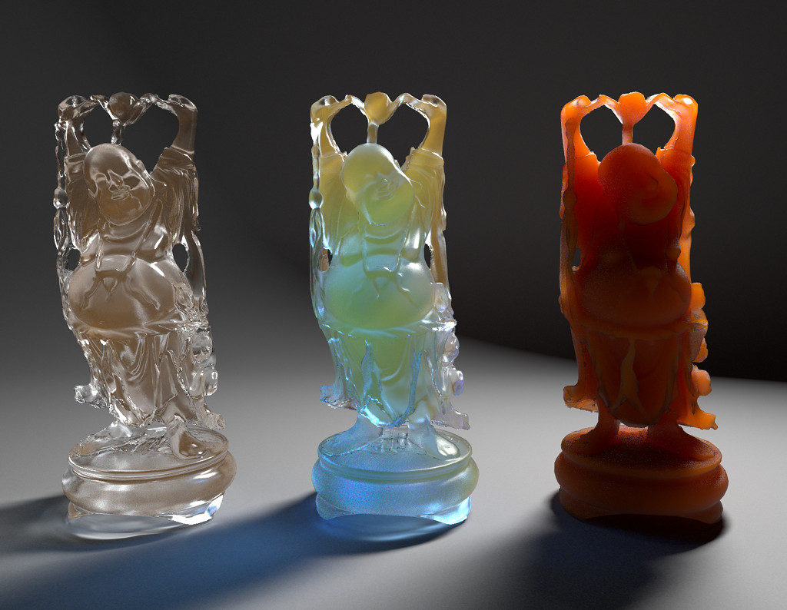
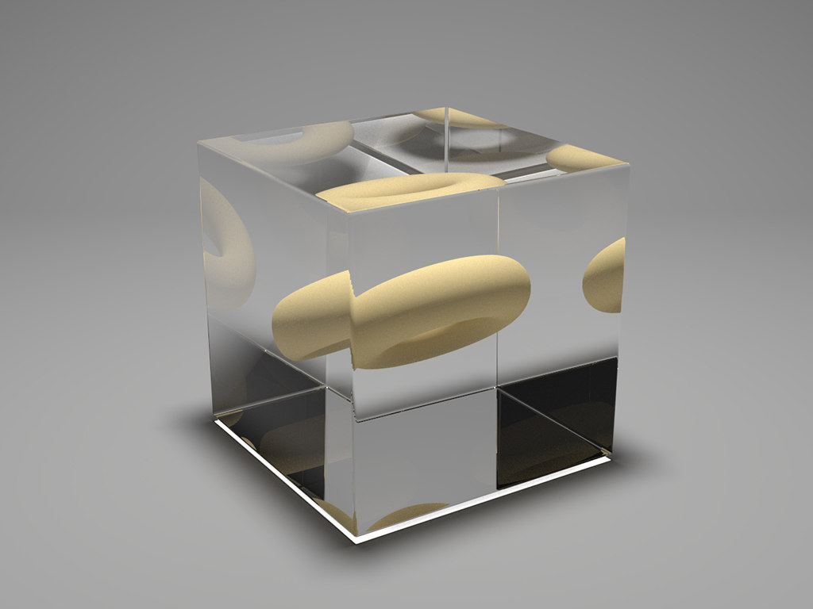
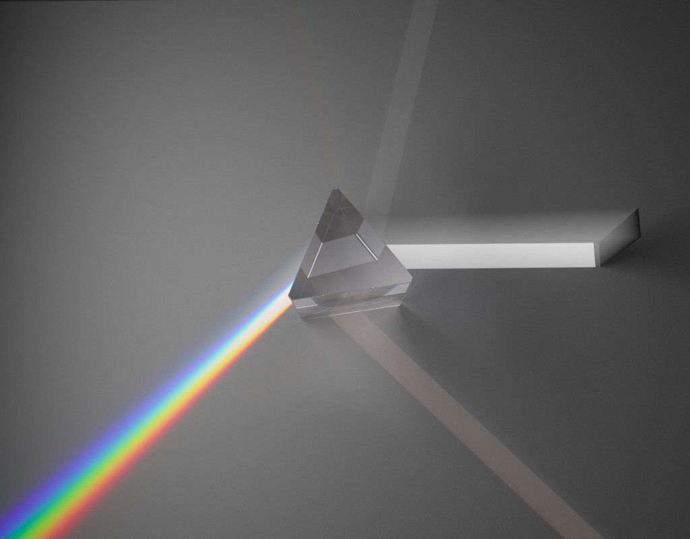
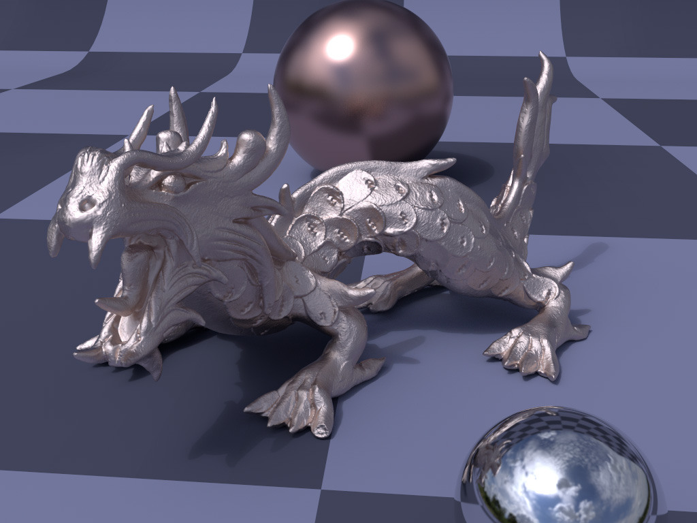
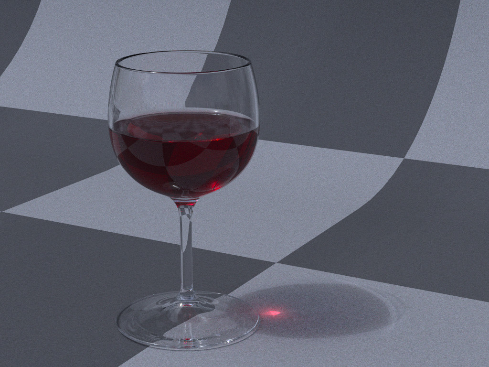
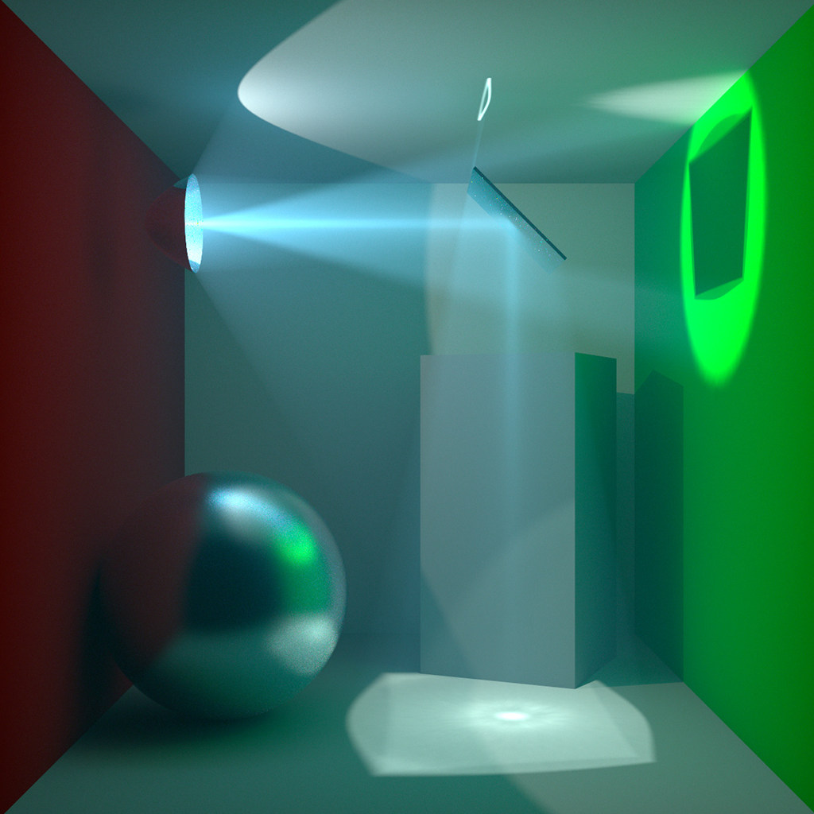

ToyTrace
========
Born out of an ancient computer graphics exercise, this is my hobby renderer.

Images
------

Features
--------

* Forward- and bidirectional path tracing.
* Volume rendering with the beam radiance estimator.
* Participating media:
    * Homogeneous chromatic collision coefficients.
    * Atmosphere model with tabulated altitude profiles.
    * Uniform-, Henley-Greenstein- and Rayleigh phase functions.
    * Spectral delta tracking.
* Materials:
    * Glossy microfacet metallic BRDF.
    * Dense dielectric with specular interface.
    * Specular mirror.
    * Specular transmissive dielectric, aka. glass shader.
    * Lambertian diffuse.
* Textures & UV mapping.
* Lights:
    * Multiple idealized light models, e.g. point lights and uniform area lights.
    * Image based lighting from HDR environment maps.
    * (Emissive Media)
* Camera:
    * Pinhole.
    * Fisheye.
* Statistical test for BSDF & Phasefunction sampling routines.
* Binned spectral representation using a few dozen wavelengths.

Dependencies
------------

* CIMG
* Eigen 3
* boost
* assimp
* OpenImageIO
* yaml-cpp
* tbb
* embree

Todo
----
Eventually, maybe, and in no particular order.

* Advanced techniques. VCM and extensions to volume rendering.
* Custom triangle intersection routines with double precision. Embree only for BVH.
* Robust intersection computations in the style of BPRT.
* Overlapping media volumes in the sense that a mixture medium comprising multiple components is rendered.
* Rendering of OpenVDB data set.
* Other geometries for the atmosphere medium: Flat (Earth) and (O'Neill) Cylinder.
* Faster MIS weight computation from the VCM paper.
* A multi-layer material.
* A sane scene description format.
* Better image reconstruction filter.
* Support for wavelength dependent index of refraction throughout all algorithms.
* Firefly suppression.
* Quasi-random sampling throughout all algorithms.
* Bloom filter.
* Physical camera.
* Texture filtering.
* Bump/normal mapping.

Related work
------------
Other projects by which this one is inspired.

* Sky Render by Peter Kutz (http://skyrenderer.blogspot.de/)
* Photorealizer by Peter Kutz (http://photorealizer.com/)
* Takua Render by Yining Karl Li (https://www.yiningkarlli.com/projects/takuarender.html)
* Tungsten Renderer by Benedikt Bitterli (https://benedikt-bitterli.me/tungsten.html)
* MagicaVoxel by ephtracy (https://ephtracy.github.io/)
* smallpt "Global Illumination in 99 lines of C++" by Kevin Beason (http://www.kevinbeason.com/smallpt/)
* JavaScript Path Tracer by Hunter Loftis  (https://github.com/hunterloftis/pathtracer)
* pbr: a Physically-Based 3D Renderer in Go by Hunter Loftis (https://github.com/hunterloftis/pbr)
* Path Tracer by Michael Fogleman (https://www.michaelfogleman.com)

Educational/Research/Reference Implementations

* Nori an educational ray tracer (http://www.cs.cornell.edu/courses/cs6630/2012sp/nori/, https://wjakob.github.io/nori/)
* PBRT (https://github.com/mmp)
* SmallVCM (http://www.smallvcm.com/)
* Unified points, beams and paths (https://github.com/PetrVevoda/smallupbp)
* Lightmetrica (http://lightmetrica.org/)
* Mitsuba Render (https://www.mitsuba-renderer.org/)

There is another ToyTrace on Github. I have nothing to do with it. I just happen to forget to check if the name is already assigned.

License
-------

All rights reserved.
